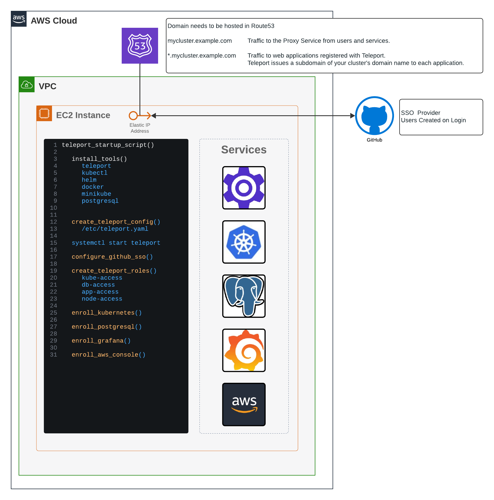
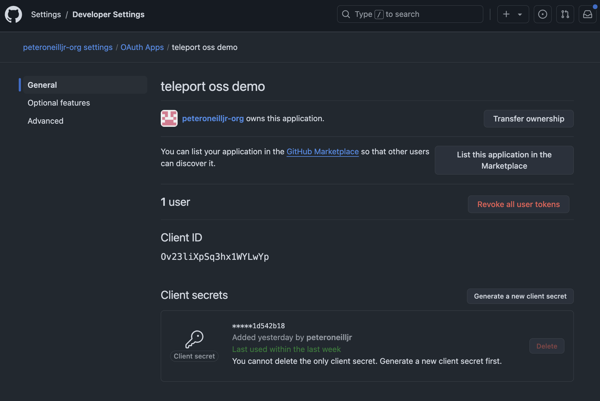
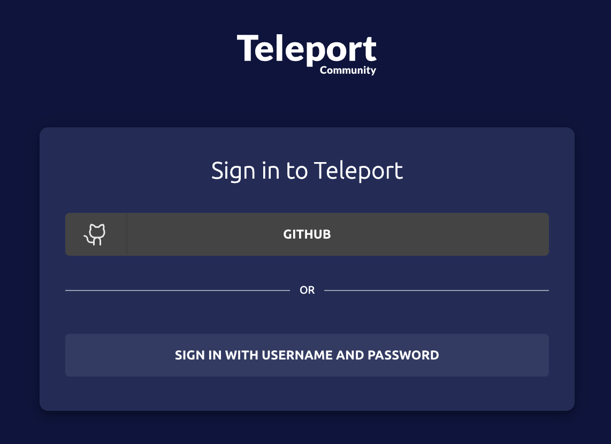
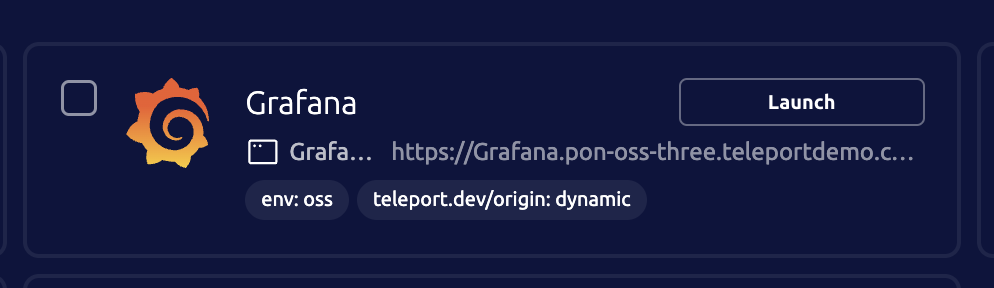
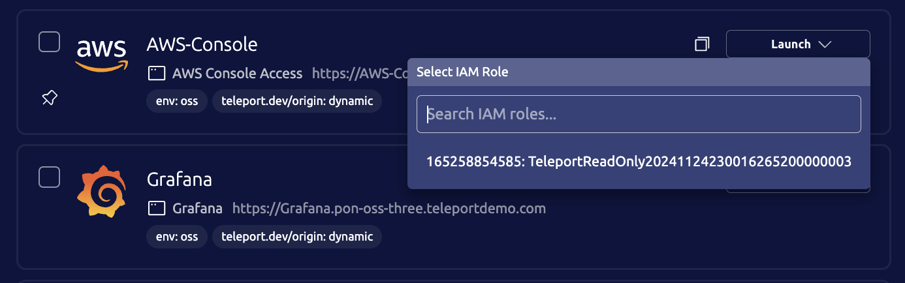
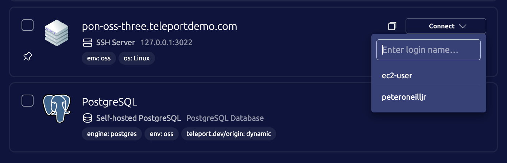

# Deploy Teleport Cluster




## Docs
* [Self Hosted Cluster](https://goteleport.com/docs/admin-guides/deploy-a-cluster/linux-demo/)
* [Kubernetes Access](https://goteleport.com/docs/enroll-resources/kubernetes-access/getting-started/)
* [Postgresql](https://goteleport.com/docs/enroll-resources/database-access/enroll-self-hosted-databases/postgres-self-hosted/)
* [Grafana](https://goteleport.com/docs/enroll-resources/application-access/getting-started/)
* [AWS Console](https://goteleport.com/docs/enroll-resources/application-access/cloud-apis/aws-console/)
* [GitHub SSO](https://goteleport.com/docs/admin-guides/access-controls/sso/github-sso/#step-24-create-a-github-authentication-connector/)

## Set Up GitHub SSO

1. Create GitHub Org
1. Create GitHub Team
1. Create GitHub OAuth App
1. Create OAuth App Secret


* Homepage URL: `https://mycluster.example.com`
* Callback URL: `https://mycluster.example.com/v1/webapi/github/callback`
* Enable Device Flow: `True`


## Create terraform.tfvars

cluster name and route53 zone will be combined to make the Proxy Address. `my-teleport-cluster.mycompany.com`

```hcl
teleport_cluster_name = "my-teleport-cluster"
teleport_email        = "myuser@example.com"
teleport_version      = "16.4.7"

aws_region           = "us-west-2"
aws_route53_zone     = "mycompany.com"

aws_tags = {
  "team"  = "Solutions Engineering"
  "Name"  = "Teleport OSS Demo"
}

gh_client_secret = "1234567890qwertyuiop1234567890"
gh_client_id     = "asdfghjklasdfghjkl"
gh_org_name      = "mycompany-org"
gh_team_name     = "admins"
```

## Run Terraform installer

You will need to authorize the AWS Provider before running terraform apply.

[AWS Provider](https://registry.terraform.io/providers/hashicorp/aws/latest/docs)

```sh
cd terraform
terraform apply
```

## Check Installation

If you want to check on the deployment status use these commands to connect the ec2 instance and check the log.
```sh
eval "$(terraform output -raw teleport_cluster_ssh)"
tail -f /var/log/cloud-init-output.log
```

## Log into web app

Navigate to the cluster's URL and login with GitHub.

```sh
terraform output teleport_cluster_fqdn
```


### Launch Grafana App

Click launch on Grafana to connect to the app.



### Launch AWS Console

Click the `TeleportReadOnly` role to launch the AWS Console.



### Connect To EC2 Instance

Click the username you'd like connect with.



## Log into Teleport CLI

### Install Teleport Locally

[Teleport Install](https://goteleport.com/docs/installation/)

For MacOS (Homebrew is not recommended)
```sh
curl -O https://cdn.teleport.dev/teleport-16.4.7.pkg
sudo installer -pkg teleport-16.4.7.pkg -target /
which teleport
```

### Authenticate to Teleport Clsuter

We will be using the same GitHub Auth Connector we used for the web. Granting the same privliges on the CLI. 
```sh
eval "$(terraform output -raw teleport_tsh_login)"
tsh status
```

### Connect to SSH Node

ssh will default to the login address. 

```sh
tsh ls
tsh ssh $NODE_NAME
```

### Connect to PostgreSQL

```sh
tsh db ls
tsh db connect PostgreSQL --db-user=teleport --db-name=teleport
```

### Connect to Kubernetes

```sh
tsh kube ls
tsh kube login MiniKube
kubectl get ns
```

### Connect to AWS CLI

Run AWS commands through the Teleport Binary
```sh
tsh apps ls
tsh apps login AWS-Console --aws-role TeleportReadOnly20241124230016265200000003
tsh aws s3 ls
tsh aws ec2 describe-instances
```

Start a proxy tunnel to use the normal AWS binary.
```sh
tsh proxy aws --app AWS-Console

Started AWS proxy on http://127.0.0.1:64985.
To avoid port randomization, you can choose the listening port using the --port flag.

Use the following credentials and HTTPS proxy setting to connect to the proxy:
  export AWS_ACCESS_KEY_ID=c020bf2e-6e17-4a05-b903
  export AWS_SECRET_ACCESS_KEY=f551de73-921e-4ac8-bc56
  export AWS_CA_BUNDLE=/Users/username/.tsh/keys/mycluster.teleport.com/username-app/mycluster.teleport.com/AWS-Console-localca.pem
  export HTTPS_PROXY=http://127.0.0.1:64985
```
